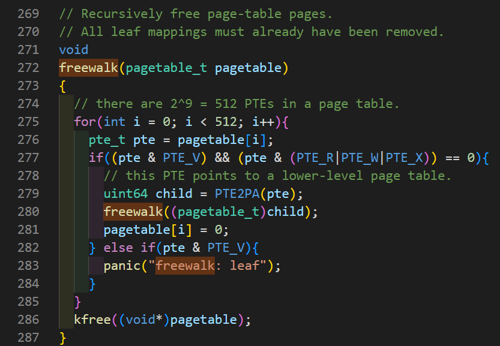
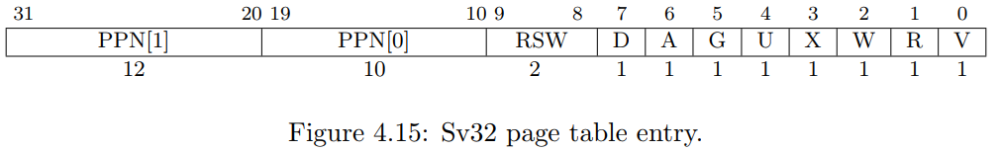

# Lab: page tables

In this lab, you will explore page tables, modify them to accelerate certain system calls, and observe which pages have been accessed.

Before starting, you need to switch the code repository to the `pgtbl` branch.

```bash
git fetch
git checkout pgtbl
make clean
```

## Speed up system calls

The principle of this lab is to store some data in a read-only shared space located between the kernel and user. This way, user programs do not need to trap into the kernel but instead directly retrieve data from this read-only space, eliminating some system overhead and accelerating certain system calls. The task this time is to improve `getpid()`.

Upon the creation of each process, map a read-only page at **USYSCALL** (a virtual address defined in `memlayout.h`). Store a `struct usyscall` (defined in `memlayout.h`) at the beginning of this page and initialize this structure to save the PID of the current process. In this lab, `ugetpid()` is already provided in user space, and it will utilize this mapping at **USYSCALL**. Run `pgtbltest`, and if successful, the `ugetpid` test should pass. (Note that this program includes two tests, so there is no need to panic).

First, add a pointer in the `kernel/proc.h` proc structure to store the address of this shared page.

```c
struct proc {
...
  struct usyscall *usyscallpage;  // share page whithin kernel and user
...
}
```

Afterwards, in the `allocproc()` function in `kernel/proc.c`, allocate space for it (`kalloc`) and initialize it to save the PID of the current process.

```c
static struct proc*
allocproc(void) {
...
  if ((p->usyscallpage = (struct usyscall *)kalloc()) == 0) {
    freeproc(p);
    release(&p->lock);
    return 0;
  }

  p->usyscallpage->pid = p->pid;
  
  // Set up new context to start executing at forkret,
  // which returns to user space.
  memset(&p->context, 0, sizeof(p->context));
  p->context.ra = (uint64)forkret;
  p->context.sp = p->kstack + PGSIZE;
...
}
```

Next, in the `proc_pagetable(struct proc *p)` function in `kernel/proc.c`, write this mapping (PTE) into the pagetable. The permission should be user-readable.

```c
pagetable_t
proc_pagetable(struct proc *p) {
...
    if(mappages(pagetable, USYSCALL, PGSIZE, (uint64)(p->usyscallpage), PTE_R | PTE_U) < 0) {
    uvmfree(pagetable, 0);
    return 0;
  }
  // map the trampoline code (for system call return)
  // at the highest user virtual address.
  // only the supervisor uses it, on the way
...
}
```

Afterwards, ensure that when releasing a process, the shared page is also released. Similarly, in the `freeproc(struct proc *p)` function in `kernel/proc.c`.

```c
static void
freeproc(struct proc *p) {
  if(p->trapframe)
    kfree((void*)p->trapframe);
  p->trapframe = 0;
  // add start
  if(p->usyscallpage)
    kfree((void *)p->usyscallpage);
  p->usyscallpage = 0;
  // add end
  if(p->pagetable)
    proc_freepagetable(p->pagetable, p->sz);
}
```

After completing these steps, running qemu will result in a `panic` error.

```bash
xv6 kernel is booting

hart 2 starting
hart 1 starting
panic: freewalk: leaf
```

This is because the previous PTE mappings still exist in the `pagetable`. We need to unmap them in the `proc_freepagetable(pagetable_t pagetable, uint64 sz)` function in `kernel/proc.c`.

```c
void
proc_freepagetable(pagetable_t pagetable, uint64 sz) {
  uvmunmap(pagetable, TRAMPOLINE, 1, 0);
  uvmunmap(pagetable, TRAPFRAME, 1, 0);
  uvmunmap(pagetable, USYSCALL, 1, 0); // add
  uvmfree(pagetable, sz);
}
```

Specific code changes can be found in the [GitHub commit].

> Note: The permissions for mapping PTE in `proc_pagetable(struct proc *p)` should be `PTE_R | PTE_U` instead of `PTE_R | PTE_U | PTE_W`.

Run `./grade-lab-pgtbl ugetpid` to obtain successful information. Alternatively, run `pgtbltest` in qemu. At this point, pgaccess_test will fail, which is the next task.

> Note: Which other xv6 system call(s) could be made faster using this shared page? Explain how.

Answer:
  Any system call that directly or indirectly invokes the `copyout` fuction will be accelerated, as it saves time on copying data. Additionally, system calls used purely for information retrieval, such as `getpid` in this section, will also be faster. This is because the operation of trapping into the operating system is no longer necessary, and the corresponding data can be read in usermode instead.

## Print a page table

The second task is to write a function to print the contents of the page table. This function is defined as `vmprint()`. It should take a parameter of type `pagetable_t` and print according to the following format. Insert `if(p->pid==1) vmprint(p->pagetable)` before `return argc` in `exec.c` to print the page table of the first process.

After completing these tasks, when you run `qemu`, you should see the following output, which is printed before the first process `init` completes.

```bash
page table 0x0000000087f6b000
 ..0: pte 0x0000000021fd9c01 pa 0x0000000087f67000
 .. ..0: pte 0x0000000021fd9801 pa 0x0000000087f66000
 .. .. ..0: pte 0x0000000021fda01b pa 0x0000000087f68000
 .. .. ..1: pte 0x0000000021fd9417 pa 0x0000000087f65000
 .. .. ..2: pte 0x0000000021fd9007 pa 0x0000000087f64000
 .. .. ..3: pte 0x0000000021fd8c17 pa 0x0000000087f63000
 ..255: pte 0x0000000021fda801 pa 0x0000000087f6a000
 .. ..511: pte 0x0000000021fda401 pa 0x0000000087f69000
 .. .. ..509: pte 0x0000000021fdcc13 pa 0x0000000087f73000
 .. .. ..510: pte 0x0000000021fdd007 pa 0x0000000087f74000
 .. .. ..511: pte 0x0000000020001c0b pa 0x0000000080007000
init: starting sh
```

Points to note:

1. You can implement `vmprint()` in `kernel/vm.c`.
2. Utilize macro definitions at the end of the `kernel/riscv.h` file.
3. The implementation approach of the `freewalk` function is very helpful for this experiment.
4. Place the declaration of the `vmprint` function in `kernel/defs.h` so that it can be called in `exec.c`.
5. Use `%p` to format and print 64-bit hexadecimal PTEs and addresses.

It's worth noting the specific implementation of the `freewalk` function. This function releases all page tables (page-table pages) by recursively accessing each subpage.



We can also adopt a recursive approach similar to the freewalk function for our `vmprint` function. However, we need to display the depth of the page table. In this case, we can set up a static variable to indicate the current depth of the printed page. It should be incremented when entering the next level of the page table and decremented upon function return. The specific implementation is as follows:

```c
void
vmprint(pagetable_t pagetable)
{
  if (printdeep == 0)
    printf("page table %p\n", (uint64)pagetable);
  for (int i = 0; i < 512; i++) {
    pte_t pte = pagetable[i];
    if (pte & PTE_V) {
      for (int j = 0; j <= printdeep; j++) {
        printf("..");
      }
      printf("%d: pte %p pa %p\n", i, (uint64)pte, (uint64)PTE2PA(pte));
    }
    // pintes to lower-level page table
    if((pte & PTE_V) && (pte & (PTE_R|PTE_W|PTE_X)) == 0){
      printdeep++;
      uint64 child_pa = PTE2PA(pte);
      vmprint((pagetable_t)child_pa);
      printdeep--;
    }
  }
}
```
> Note: Explain the output of vmprint in terms of Fig 3-4 from the text. What does page 0 contain? What is in page 2? When running in user mode, could the process read/write the memory mapped by page 1? What does the third to last page contain?

  page0: date and text of process
  page1: guard page for protect stack by present page0 overflow
  page2: stack of process
  page3 to last page: heap, trapfram, trampoline

  ==> When the program is running in user mode, it cannot read/write page 1 (the guard page) because it is designed to protect page 2 (the stack page) from being accessed by the user.

Specific code changes can be found in the [GitHub commit]

## Detect which pages have been accessed

首先需要了解的是，在一个 `Risc V Sv32` page table 包含了 2^10 个 PTEs，每一个 4 bytes。`Sv32` PTE 的图示如下：



Refer to pages 68 and following of the [RISC-V privileged architecture manual](https://github.com/riscv/riscv-isa-manual/releases/download/Ratified-IMFDQC-and-Priv-v1.11/riscv-privileged-20190608.pdf) for more details.

> Each leaf PTE contains an accessed (A) and dirty (D) bit. The A bit indicates the virtual page has been read, written, or fetched from since the last time the A bit was cleared. The D bit indicates the virtual page has been written since the last time the D bit was cleared.  

 The (A) bit represents that this virtual page has been accessed (read, written, or fetched) since the last time the (A) bit was cleared (set to zero).

In this experiment, we will implement a system call `sys_pgaccess()` in the file `kernel/sysproc.c`. This system call will inform us which pages have been accessed. This system call takes three parameters. The first parameter is the starting virtual address of the first user page to be checked. The second parameter is the number of pages to be checked. The third parameter is an address in the user address space to receive the results written in the form of a bitmask. (A bitmask is a data structure where each bit represents a page, with the first page represented by the least significant bit).

Some hint：

1. The `pgacess_test()` in `user/pgtlbtest.c` demonstrates how to use `pgaccess`.
2. Use `argaddr()` and `argint()` to retrieve parameters.
2. For the `bitmask` value to be returned, establish a temporary buffer in the kernel and then use `copyout` to copy it to the user space.
4. You can limit the maximum number of pages that can be scanned (not implemented in my implementation).
5. The `walk()` function in `kernel/vm.c` is useful. It can find the PTE corresponding to a virtual address and return its physical address.
6. You need to define a `PTE_A` in `kernel/riscv.h`, which is the access bit defined by `RISC-V`. For more details, refer to the [RISC-V privileged architecture manual](https://github.com/riscv/riscv-isa-manual/releases/download/Ratified-IMFDQC-and-Priv-v1.11/riscv-privileged-20190608.pdf).
7. After checking whether the `PTE_A` bit is set, **make sure to clear it**. If not cleared, these bits will all be set to 1 because the process of checking whether it is set accesses the page, and it cannot be determined whether the page (before being checked) has been accessed in subsequent processes.
8. `vmprint()` can be useful when debugging page tables.

The usage of the `walk()` function is very important as it can find the address of a `PTE` corresponding to a virtual address. And we need to examine the PTE to determine whether it has been accessed (`PTE_A` is set).

Another important thing is to clear this `PTE_A` bit after checking it, which is in the 6th bit of the `PTE` (counting from zero). How can we set a specified bit of a binary value to a specified value?


Formula: `x = ((x&(1 << n)) ^ x) ^ (a << n)`. For detailed explanation, refer to the article: [How to Set a Specified Bit of a Binary Value to a Specified Value](./BinValueToSpecValue.md).

Implementation as follows:

```c
int
sys_pgaccess(void)
{
  uint64 va;
  int pagenum;
  uint64 abitsaddr;
  argaddr(0, &va);
  argint(1, &pagenum);
  argaddr(2, &abitsaddr);

  uint64 maskbits = 0;
  struct proc *proc = myproc();
  for (int i = 0; i < pagenum; i++) {
    pte_t *pte = walk(proc->pagetable, va+i*PGSIZE, 0);
    if (pte == 0)
      panic("page not exist.");
    if (PTE_FLAGS(*pte) & PTE_A) {
      maskbits = maskbits | (1L << i);
    }
    // clear PTE_A, set PTE_A bits zero
    *pte = ((*pte&PTE_A) ^ *pte) ^ 0 ;
  }
  if (copyout(proc->pagetable, abitsaddr, (char *)&maskbits, sizeof(maskbits)) < 0)
    panic("sys_pgacess copyout error");

  return 0;
}
```

All file changes can be seen in: [github commit]