# Lab: system calls

This lab will cover how to use GDB for debugging and implementing two system call functions.

Before getting started, make sure to switch git to the `syscall` branch.

~~~bash
cd xv6-labs-2022
git checkout syscall
make clean
~~~

## Using gdb

First, learn how to use GDB to debug xv6. Refer to [this page](https://pdos.csail.mit.edu/6.828/2022/labs/gdb.html) for information.

Note that in Ubuntu 20.04.5 LTS, you need to install and use `gdb-multiarch` to debug `riscv64` programs.

Navigate to the `xv6-labs-2022` folder.

In the terminal, enter `make qemu-gdb`. This will run QEMU and enable debugging. Here, the port is **26000**. Now open another terminal and run `gdb-multiarch -x .gdbinit`. This will run the commands in `.gdbinit`, enabling remote debugging and setting the `arch` to `riscv64`. For details, refer to the `.gdbinit` file.

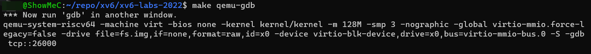

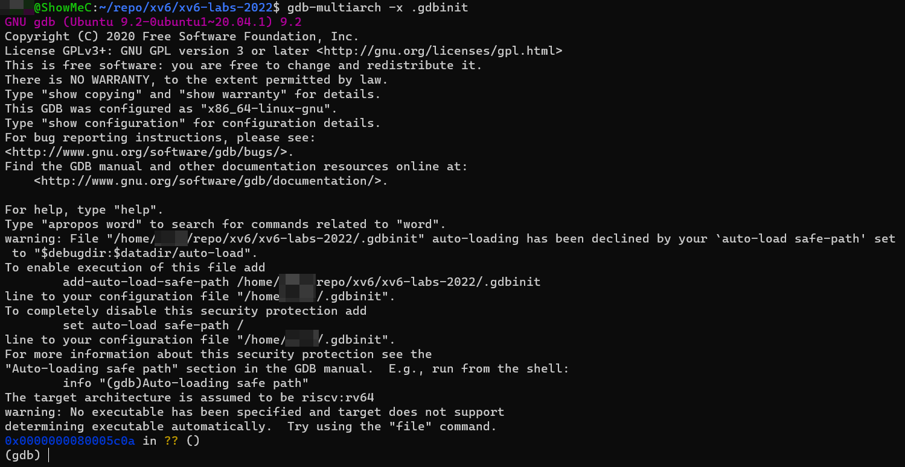

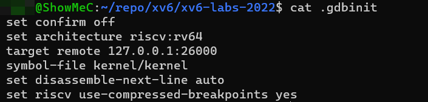

The important thing to note is that if gdb is restarted, qemu should also be restarted. Otherwise, unexpected issues may arise.

### 0x1

Run the following commands in GDB:

~~~bash
(gdb) b syscall
Breakpoint 1 at 0x80001fe0: file kernel/syscall.c, line 133.
(gdb) c
Continuing.
[Switching to Thread 1.3]

Thread 3 hit Breakpoint 1, syscall () at kernel/syscall.c:133
133     {
(gdb) layout src
(gdb) backtrace
~~~

`b syscall` sets a breakpoint at the `syscall` function. `c` runs until this breakpoint is reached. `layout src` opens a window to display the source code during debugging. `backtrace` prints the stack backtrace.

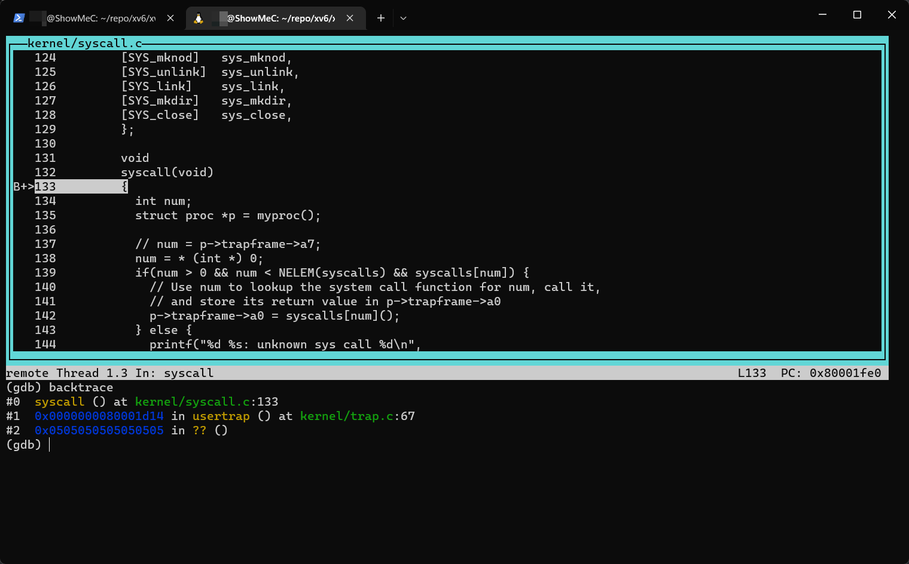

So, the first question is:

> Looking at the backtrace output, which function called `syscall`?

Syscall được gọi bởi `usertrap()`, được thể hiện trong output của `backtrace`.

### 0x2

Execute a few `n` commands to execute `struct proc *p = myproc();` and print the value of `*p`, which is a proc struct.

~~~bash
(gdb) n
(gdb) n
(gdb) p/x *p
~~~

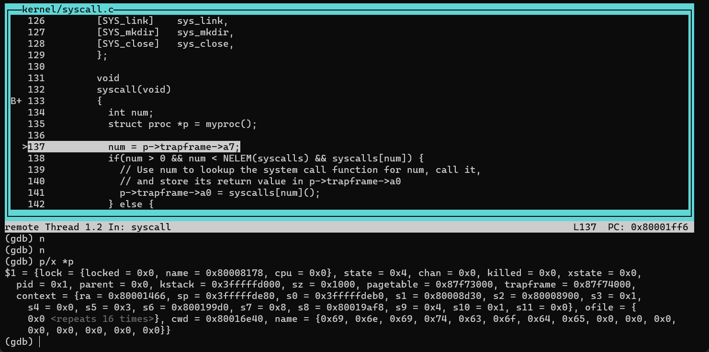

So, the second question is:

> What is the value of `p->trapframe->a7` and what does that value represent? (Hint: look `user/initcode.S`, the first user program xv6 starts.)

- Giá trị của `p->trapframe->a7` bằng 7
-	Mở thư mục initcode.S trong user, ta thấy number syscall được lưu trong thanh ghi a7.
-	Trong trường hợp này, number syscall là 7. Mở file kernal/syscall.h để xem chi tiết. Số 7 đại dại cho SYS_exec.

~~~bash
(gdb) p p->trapframe->a7
$2 = 7
(gdb)
~~~

The value of `a7` is `7`. According to the reference material [xv6 book](https://pdos.csail.mit.edu/6.828/2022/xv6/book-riscv-rev1.pdf) Chapter 2 and the code in `user/initcode.S`, it is known that the `a7` register holds the system call number to be executed. Here, the system call number is `7`, which can be found in `kernel/syscall.h`, representing the system call `SYS_exec`.

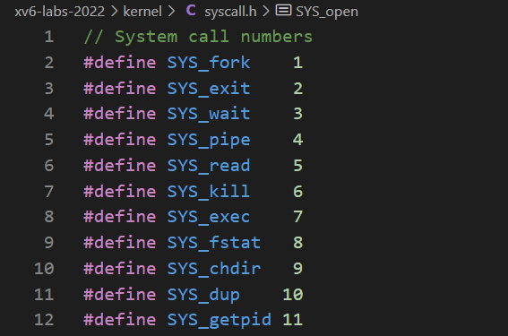

### 0x3

System calls run in `kernel mode` and the current CPU state can be viewed using the **Supervisor Status Register (sstatus)**. For more details, refer to the official [RISC-V privileged instructions](https://github.com/riscv/riscv-isa-manual/releases/download/Priv-v1.12/riscv-privileged-20211203.pdf) document, Section 4.1.1.

Input GDB commands to view the `sstatus` register. Use `p/t` to print it in binary format.

~~~bash
(gdb) p/t $sstatus
$4 = 100010
(gdb)
~~~

This is the official documentation illustration of the `sstatus` register. Refer to [RISC-V Privilieged ISA](http://docs.keystone-enclave.org/en/latest/Getting-Started/How-Keystone-Works/RISC-V-Background.html#risc-v-privilieged-isa). And the following explanation:

>The SPP bit indicates the privilege level at which a hart was executing before entering supervisor mode. When a trap is taken, SPP is set to 0 if the trap originated from user mode, or 1 otherwise. When an SRET instruction (see Section 3.3.2) is executed to return from the trap handler, the privilege level is set to user mode if the SPP bit is 0, or supervisor mode if the SPP bit is 1; SPP is then set to 0.

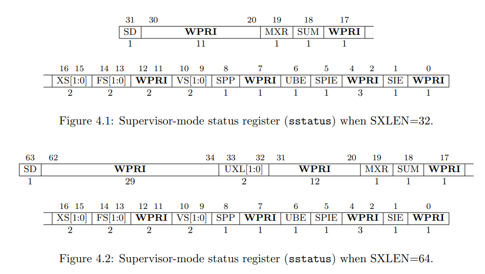

According to the binary value of `sstatus`, which is `100010`, we can infer that the SPP bit is `0`, indicating that the privilege level before entering the kernel during a system call trap is user mode.

So the question is:

> What was the previous mode that the CPU was in?

- Theo các hướng dẫn về các lệnh đặc quyền của RISC-V, `bit SPP` chỉ ra cấp độ đặc quyền mà một hart đang thực thi trước khi vào chế độ giám sát. Khi một trap được thực hiện, SPP được thiết lập thành 0 nếu trap xuất phát từ chế độ người dùng, hoặc 1 nếu không. Khi một lệnh `SRET` (xem Mục 3.3.2) được thực thi để trở về từ trình xử lý trap, cấp độ đặc quyền được thiết lập tương ứng.
-	Như ta có thể thấy, giá trị của bit SPP là 0, điều này chỉ ra rằng cấp độ đặc quyền trước khi vào kernel để thực hiện cuộc gọi hệ thống là chế độ người dùng `user mode`.
-	Tiếp theo, thực hiện thay thế câu lệnh `num = p->trapframe->a7` bằng `num = * (int *) 0` trong hàm syscall của kernel/syscall.c.

### 0x4

In subsequent experiments, the code we write may cause the kernel to panic. For example, replacing `num = p->trapframe->a7;` in the `syscall()` function with `num = * (int *) 0;`, and then running `make qemu`. This will result in a panic message.

> Note: The `syscall` function is located at line 132 in `kernel/syscall.c`

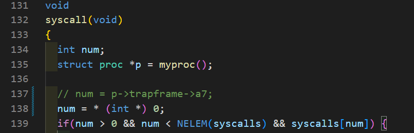

~~~bash
xv6 kernel is booting

hart 2 starting
hart 1 starting
scause 0x000000000000000d
sepc=0x0000000080001ff4 stval=0x0000000000000000
panic: kerneltrap
~~~

Here, `sepc` refers to the address of the code in the kernel where the panic occurred. You can find the compiled complete kernel assembly code in `kernel/kernel.asm`, and by searching for this address, you can find the code that caused the kernel panic. The value of `sepc` is not fixed.

Here it is `0x0000000080001ff4`, so I search for `80001ff4` in `kernel/kernel.asm`.

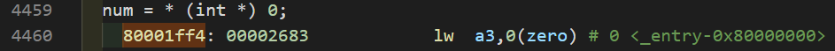

As you can see, indeed it is `num = * (int *) 0;` that causes the kernel panic. The corresponding assembly instruction is `lw a3,0(zero)`. For a brief introduction to some RISC-V assembly instructions, you can refer to [RISC-V Assembly Language](https://web.eecs.utk.edu/~smarz1/courses/ece356/notes/assembly/).

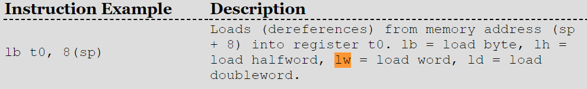

So, this assembly instruction represents: loading data of one word (2 bytes) size from the memory address starting from 0 into register `a3`.

So the question is:

> Write down the assembly instruction the kernel is panicing at. Which register corresponds to the varialable `num`?

The answer is: the kernel panics at `lw a3,0(zero)`. `num` corresponds to the `a3` register.
-	Sepc cho biết địa chỉ của mã nơi mà kernal đang gặp sự cố. Trong trường hợp này ta tìm kiếm địa chỉ 80002052 trong kernal/kernal.asm
-	Dựa vào đoạn code trên, có thể thấy chính sự thay đổi câu lệnh gây ra lỗi cho kernal. Tương đương cho câu lệnh lỗi này băng ngôn ngữ assembly là lw a3,0(zero) với num là s2.

0x5

Run the virtual machine and GDB debugger again. Set a breakpoint at the point where the panic occurs.

~~~bash
(gdb) b *0x0000000080001ff4
Breakpoint 1 at 0x80001ff4: file kernel/syscall.c, line 138.
(gdb) c
Continuing.

Thread 1 hit Breakpoint 1, syscall () at kernel/syscall.c:138
(gdb) layout asm
(gdb) n
(gdb) Ctrl + C # Keyboard input ends Thread
(gdb) p $scause
$1 = 13
~~~

After entering `n` again, a panic will occur. At this point, enter `Ctrl + C` to end it. Check the `scase` register, which indicates the reason for the kernel panic. Refer to Section 4.1.8 of the [RISC-V privileged instructions](https://pdos.csail.mit.edu/6.828/2022/labs/n//github.com/riscv/riscv-isa-manual/releases/download/Priv-v1.12/riscv-privileged-20211203.pdf) document. Below is the Exception Code diagram.

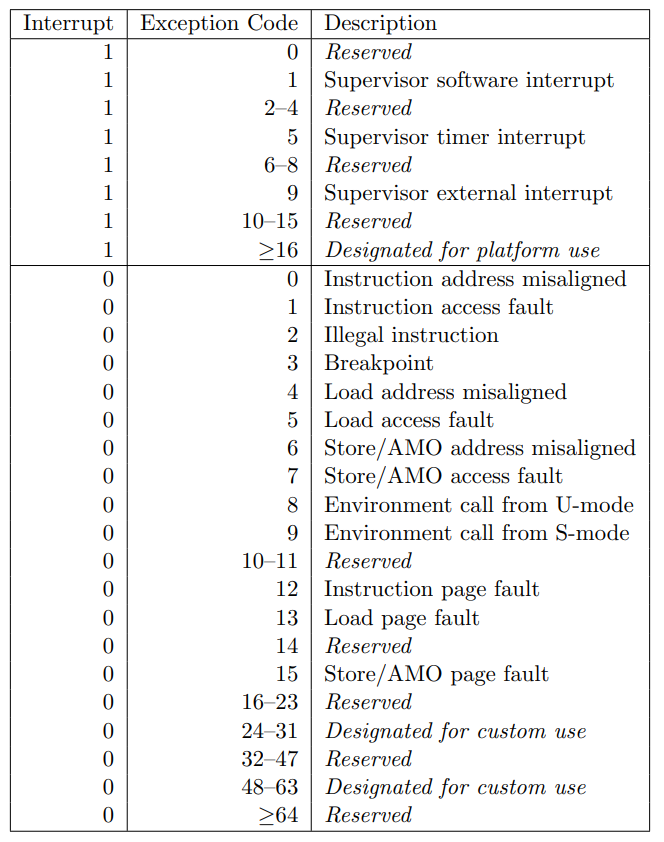

So, here `13` represents `Load page fault`, meaning an error occurred when loading data from memory address 0 into register a3. What data is at address 0? The answer can be found in **Figure 3.3** of this textbook [book-riscv-rev3.pdf](https://pdos.csail.mit.edu/6.828/2022/xv6/book-riscv-rev3.pdf).

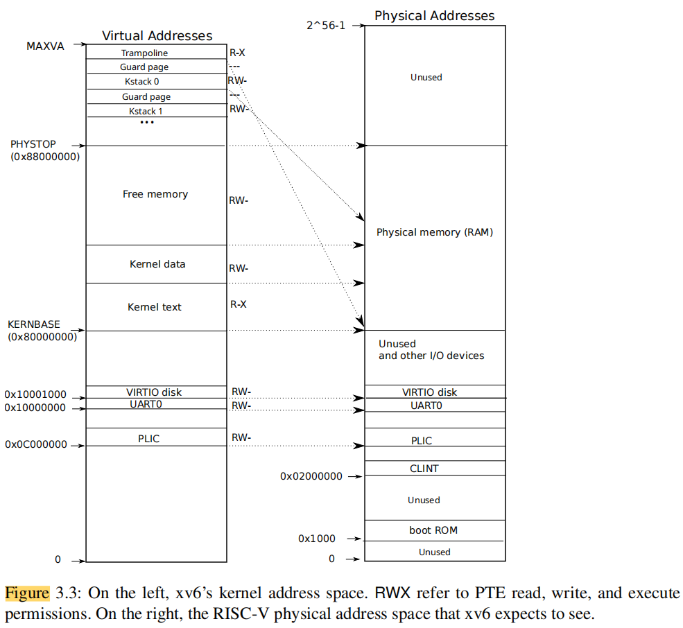

As you can see, the address 0 in the left Virtual Address corresponds to Unused in the right Physical Address, indicating that this address is not being used. However, the Kernel starts from the virtual address `0x80000000`.

那么问题：

> Why does the kernel crash? Hint: look at figure 3-3 in the text; is address 0 mapped in the kernel address space? Is that confirmed by the value in `scause` above? (See description of `scause` in [RISC-V privileged instructions](https://pdos.csail.mit.edu/6.828/2022/labs/n//github.com/riscv/riscv-isa-manual/releases/download/Priv-v1.12/riscv-privileged-20211203.pdf))

-	Theo các hướng dẫn về các lệnh đặc quyền của RISC-V, giá trị 13 ở đây đại diện cho một lỗi trang tải. Cụ thể, một lỗi đã xảy ra trong khi tải dữ liệu từ địa chỉ bộ nhớ `0` vào `s2`. Có thể thấy từ sách giáo trình, địa chỉ 0 không ánh xạ vào không gian kernel; thay vào đó, nó bắt đầu tại địa chỉ ảo `0x80000000`.

### 0x5

The above `scause` indicates the reason for the kernel panic. However, sometimes we need to know which user program triggered the panic when calling a syscall. This can be determined by printing the `name` field of the `proc` structure.

Restart qemu and gdb.

~~~bash
(gdb) b syscall
Breakpoint 1 at 0x80001fe0: file kernel/syscall.c, line 133.
(gdb) c
Continuing.
[Switching to Thread 1.3]

Thread 3 hit Breakpoint 1, syscall () at kernel/syscall.c:133
133     {
(gdb) layout src
(gdb) n
(gdb) n
(gdb) p p->name
$1 = "initcode\000\000\000\000\000\000\000"
(gdb)
~~~

It can be seen that this user program is `initcode`, which is also the first process in xv6.

Printing the `proc` structure can reveal additional information about this process.

~~~bash
(gdb) p *p
$3 = {lock = {locked = 0, name = 0x80008178 "proc", cpu = 0x0}, state = RUNNING, chan = 0x0, killed = 0, xstate = 0,
  pid = 1, parent = 0x0, kstack = 274877894656, sz = 4096, pagetable = 0x87f73000, trapframe = 0x87f74000, context = {
    ra = 2147488870, sp = 274877898368, s0 = 274877898416, s1 = 2147519792, s2 = 2147518720, s3 = 1, s4 = 0, s5 = 3,
    s6 = 2147588560, s7 = 8, s8 = 2147588856, s9 = 4, s10 = 1, s11 = 0}, ofile = {0x0 <repeats 16 times>},
  cwd = 0x80016e40 <itable+24>, name = "initcode\000\000\000\000\000\000\000"}
(gdb)
~~~

It can be seen that the `initcode `process has a pid of 1.

The question is:

> What is the name of the binary that was running when the kernel paniced? What is its process id (`pid`)?

Answer: Có thể thấy rằng quá trình `initcode` có pid là 1.
- Thông tin này có thể được lấy bằng cách in ra trường `name` của cấu trúc dữ liệu `proc`:
$1 = "initcode\000\000\000\000\000\000\000"
- Có thể thấy rằng chương trình người dùng này là `initcode`, chính là quá trình đầu tiên trong xv6. In ra cấu trúc `proc` sẽ cho phép ta kiểm tra thêm thông tin về quá trình này.
- Khi đó ta thấy pid của `initcode` là 1.

> Note: Some debugging methods can be found on the official website's PPT [Using the GNU Debugger](https://pdos.csail.mit.edu/6.828/2019/lec/gdb_slides.pdf) and [guidance page](https://pdos.csail.mit.edu/6.828/2022/labs/guidance.html).

## System call tracing

In this assignment you will add a system call `tracing feature` that may help you when debugging later labs. You'll create a new `trace` system call that will control tracing. It should take one argument, an integer `mask`, whose bits specify which system calls to trace. For example, to trace the `fork` system call, a program calls `trace(1 << SYS_fork)`, where `SYS_fork` is a syscall number from `kernel/syscall.h`. You have to modify the xv6 kernel to print out a line when each system call is about to return, if the system call's number is set in the mask. The line should contain the process id, the name of the system call and the return value; you don't need to print the system call arguments. The trace system call should enable tracing for the process that calls it and any children that it subsequently forks, but should not affect other processes.

Some hints:

1. Add `$U/_trace` to UPROGS in Makefile
2. Run `make qemu` and you will see that the compiler cannot compile `user/trace.c`, because the `user-space stubs` for the system call don't exist yet: add a prototype for the system call to `user/user.h`, a stub to `user/usys.pl`, and a syscall number to `kernel/syscall.h`. The Makefile invokes the perl script user/usys.pl, which produces `user/usys.S`, the actual system call stubs, which use the RISC-V ecall instruction to transition to the kernel. Once you fix the compilation issues, run `trace 32 grep hello README`; it will fail because you haven't implemented the system call in the kernel yet.
3. Add a `sys_trace()` function in `kernel/sysproc.c` that implements the new system call by remembering its argument in a new variable in the `proc` structure (see kernel/proc.h). The functions to retrieve system call arguments from user space are in `kernel/syscall.c`, and you can see examples of their use in `kernel/sysproc.c`.
4. Modify `fork()` (see `kernel/proc.c`) to copy the trace mask from the parent to the child process.
5. Modify the `syscall()` function in `kernel/syscall.c` to print the trace output. You will need to add an array of syscall names to index into.

The key to this problem lies in how to specify that only information for a specified syscall number should be printed in the `syscall()` function. Thus, this mask becomes crucial.

For example, `1 << SYS_read`, which is equivalent to `1 << 5`, has a binary value of `100000`. In this case, if the fifth bit of this binary value (counting from 0) is 1, it means that the syscall number 5 needs to be printed.

Another example from the official website is `trace trace 2147483647`, where `2147483647` is the binary `01111111111111111111111111111111`, with all 31 low bits set to 1, indicating that syscall numbers up to 30 (inclusive) need to be traced.

You can use a mask to determine whether known system calls need to be traced and printed, as follows:

~~~c
if ( (mask >> num) & 0b1 )
    output
~~~

That is, you can check whether a particular bit is set to 1 to determine if it needs to be printed.

### Answer

You can test it by running `./grade-lab-syscall trace`.

## Sysinfo

In this assignment you will add a system call, `sysinfo`, that collects information about the running system. The system call takes one argument: a pointer to a `struct sysinfo` (see `kernel/sysinfo.h`). The kernel should fill out the fields of this struct: the freemem field should be set to the number of bytes of free memory, and the `nproc` field should be set to the number of processes whose state is not `UNUSED`. We provide a test program `sysinfotest`; you pass this assignment if it prints "sysinfotest: OK".

Some hints:

1. Add `$U/_sysinfotest` to UPROGS in Makefile
2. Run `make qemu`; user/sysinfotest.c will fail to compile. Add the system call sysinfo, following the same steps as in the previous assignment. To declare the prototype for `sysinfo()` in `user/user.h` you need predeclare the existence of struct sysinfo:

~~~c
    struct sysinfo;
    int sysinfo(struct sysinfo *); 
~~~
> Once you fix the compilation issues, run sysinfotest; it will fail because you haven't implemented the system call in the kernel yet.

3. `sysinfo` needs to copy a struct sysinfo back to user space; see `sys_fstat()` (`kernel/sysfile.c`) and `filestat()` (`kernel/file.c`) for examples of how to do that using `copyout()`.
4. To collect the amount of `free memory`, add a function to `kernel/kalloc.c`.
5. To collect the number of `processes`, add a function to `kernel/proc.c`.

### Answer

You can test it by running `./grade-lab-syscall sysinfo`.