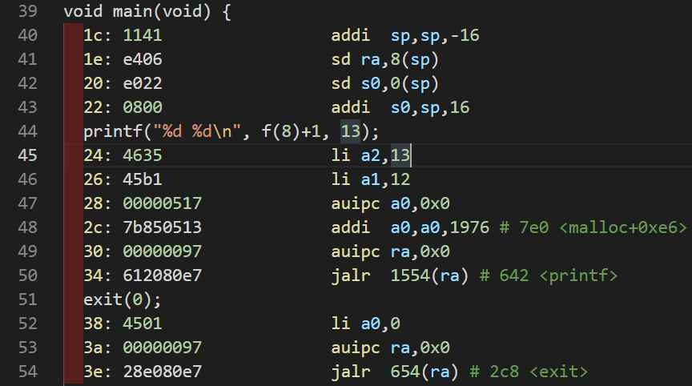
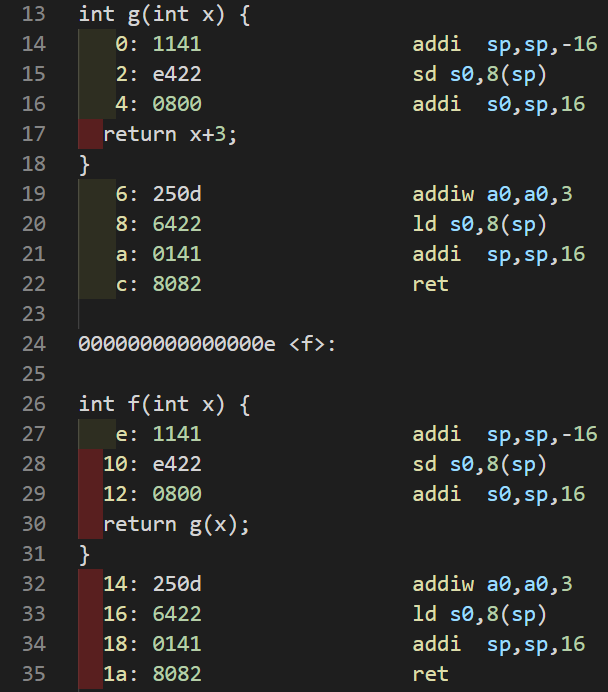
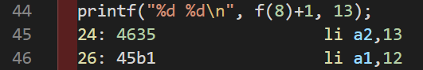
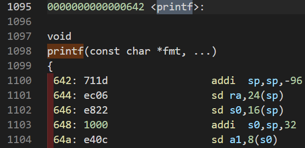
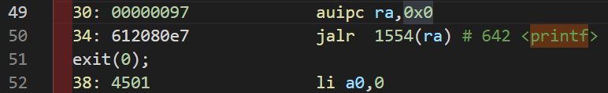

# Lab: traps

This experiment will explore how system calls are implemented using traps. First, we will warm up by using the stack, then you will implement an example of user-level trap handling.

> Read Chapter 4 of the [xv6 book](https://pdos.csail.mit.edu/6.828/2022/xv6/book-riscv-rev3.pdf) and the associated files below.
>
> - `kernel/trampoline.S`: Assembly code for transitioning from user space to kernel space and back.
> - `kernel/trap.c`: Code handling all interrupts.

Before starting, switch to the `trap` branch.

```bash
git fetch
git checkout traps
make clean
```

## RISC-V assembly

Understanding RISC-V assembly code is crucial. Use the command `make fs.img` to compile `user/call.c`. This will generate a readable assembly code file named `user/call.asm`.

Read the `g`, `f`, and `main` functions in `call.asm`. Refer to the [reference page](https://pdos.csail.mit.edu/6.828/2022/reference.html)。 for assistance.

### 0x1

> Which registers contain arguments to functions? For example, which register holds 13 in main's call to `printf`?

Based on the previous reading, it's understood that parameter passing during function calls uses general registers such as `a1`, `a2`, etc.

Read line 45 of the `call.asm` file.



Based on the reading of the main function in the `call.asm` file, it's evident that the value `13` is saved in register `a2` when calling the `printf` function.

Answer:

General registers such as `a1`, `a2`, `a3`, etc.; `13` is saved in register `a2`.
### 0x2

> Where is the call to function `f` in the assembly code for main? Where is the call to `g`? (Hint: the compiler may inline functions.)

By reading functions `f` and `g`, it's evident that function `f` calls function `g`, and function g returns the sum of the passed parameter plus 3.



So, in summary, function `f` returns the sum of the passed parameter plus 3. Considering compiler optimization like inlining, it implies that some obvious, computable data is resolved at compile time rather than being handled through function calls.

Checking the `main` function reveals that there is a call to `f` within `printf`.



However, the corresponding assembly code directly replaces `f(8)+1` with `12`. This indicates that the compiler optimized this function call. So, in the assembly code of the `main` function, there is no invocation of functions `f` and `g`. Instead, the compiler computed it before runtime.

Answer:

The assembly code of `main` does not call functions `f` and `g`. The compiler optimized it.

### 0x3

> At what address is the function `printf` located?

It's easy to locate the position of the `printf` function through searching.



Its address is at `0x642`.

Answer:

`0x642`

### 0x4

> What value is in the register `ra` just after the `jalr` to `printf` in `main`?

The combination of `auipc` and `jalr` allows jumping to any 32-bit address.



For specific details about the related commands, please refer to the following links: [reference1](https://xiayingp.gitbook.io/build_a_os/hardware-device-assembly/risc-v-assembly), [RISC-V unprivileged instructions](https://github.com/riscv/riscv-isa-manual/releases/download/Ratified-IMAFDQC/riscv-spec-20191213.pdf).

In line 49, use `auipc ra,0x0` to store the value of the current program counter `pc` into `ra`.

In line 50, `jalr 1554(ra)` jumps to the offset address corresponding to the `printf` function, which is the location `0x642`.

According to the information from [reference1](https://xiayingp.gitbook.io/build_a_os/hardware-device-assembly/risc-v-assembly), after executing this instruction, the value of register `ra` is set to `pc + 4`, which is the `return address` `0x38`.

Answer:

After the execution of the `jalr` instruction, the value of ra is `0x38`.

### 0x5

> Run the following code.
>
> ```c
> unsigned int i = 0x00646c72;
> printf("H%x Wo%s", 57616, &i);
> ```
>
> What is the output? [Here's an ASCII table](https://www.asciitable.com/) that maps bytes to characters.
>
> The output depends on that fact that the RISC-V is little-endian. If the RISC-V were instead big-endian what would you set `i` to in order to yield the same output? Would you need to change `57616` to a different value?
>
> [Here's a description of little- and big-endian](http://www.webopedia.com/TERM/b/big_endian.html) and [a more whimsical description](https://www.rfc-editor.org/ien/ien137.txt).

Please check the online C Compiler's output [c++ sell](https://cpp.sh/?source=%2F%2F+Example+program%0A%23include+%3Cstdio.h%3E%0A%0Aint+main()%0A%7B%0A++unsigned+int+i+%3D+0x00646c72%3B%0Aprintf(%22x%3D%25d+y%3D%25d%22%2C+3)%3B%0Areturn+0%3B%0A%7D), which prints   .

First, `57616` converted to hexadecimal is `e110`, so the format specifier %`x` prints out its hexadecimal value.

Second, if on a little-endian processor, where the **high byte of the data** `0x00646c72` **is stored at the high address in memory**, then reading from **the low address in memory**, which is the **low byte**, corresponds to the ASCII characters `rld`.

If on a big-endian processor, where the **high byte of the data** `0x00646c72` **is stored at the low address in memory**, then reading from the low address in memory, which is the **high byte**, results in the ASCII characters `dlr`.

So if the big-endian and little-endian outputs are the same for `i`, then when it's big-endian, the value of i should be `0x726c64`, ensuring that the output when reading from the low address in memory is `rld`.

Whether `57616` is in big-endian or little-endian, its binary value remains `e110`. Big-endian and little-endian only change the way multi-byte data is stored in memory, but they do not alter the actual value's size, so `57616` always prints as binary `e110`.

Regarding endianness, you can refer to [CSDN](https://blog.csdn.net/wwwlyj123321/article/details/100066463) for more information.

Answer:

If in big-endian, the value of `i` should be `0x00646c72` to ensure it matches the content output in little-endian. There is no need to change the value of `57616`.

### 0x6

> In the following code, what is going to be printed after `'y='`? (note: the answer is not a specific value.) Why does this happen?
>
> ```c
> printf("x=%d y=%d", 3);
> ```

From the previous sections, we know that function parameters are passed through registers `a1`, `a2`, etc. If `printf` is called with one parameter missing, it will still attempt to read the desired parameter value from a specific register. However, since we haven't provided this specific parameter and stored it in a register, the function will fetch a random, undefined value from this register as its parameter. Therefore, in this example, the value after `y=` cannot be determined; it is a garbage value.

Answer:

The value after `y=` is an undefined garbage value.

## Backtrace

Print out the `backtrace`, which is a list of function calls present in the stack when an error occurs, aiding in debugging. The register `s0` contains a pointer to the current `stack frame`. Our task is to traverse the entire stack using stack frames and print the `return address` in each stack frame.

Implement a `backtrace()` function in `kernel/printf.c`, and call it in `sys_sleep`. Afterwards, run `bttest`, which will invoke `sys_sleep`. You and the output should be a list of **return addresses**, like the following (the numbers may vary):

```bash
backtrace:
0x0000000080002cda
0x0000000080002bb6
0x0000000080002898
```

Important notes:

1. Add the function declaration of `backtrace()` in `kernel/defs.h` so that `backtrace` can be called in `sys_sleep`.

2. GCC compiler stores the frame pointer of the currently executing function into register `s0`. Add the following code in `kernel/riscv.h`:

   1. ```bash
      static inline uint64
      r_fp()
      {
        uint64 x;
        asm volatile("mv %0, s0" : "=r" (x) );
        return x;
      }
      ```

   2. When calling this function in `backtrace`, it will read the current frame pointer. `r_fp()` uses [inline assembly](https://gcc.gnu.org/onlinedocs/gcc/Using-Assembly-Language-with-C.html) to read `s0`.

3. There is an illustration of the stack frame layout in the [lecture notes](https://pdos.csail.mit.edu/6.1810/2022/lec/l-riscv.txt). Note that the return address is at an offset of -8 from the frame pointer, and the previous frame pointer is at a fixed offset (-16) from the current frame pointer.

4. Traversing the stack frames requires a stopping condition. Useful information is that each kernel stack consists of an entire page (aligned to 4k), and all stack frames are on the same page. You can use `PGROUNDDOWN(fp)` to locate the page where the frame pointer resides, thus determining the stopping condition for the loop.

> `PGROUNDDOWN(fp)` always represents the starting position of the page where `fp` resides.

So, to add this function in `printf`:

```c
void
backtrace(void)
{
  uint64 fp_address = r_fp();
  while(fp_address != PGROUNDDOWN(fp_address)) {
    printf("%p\n", *(uint64*)(fp_address-8));
    fp_address = *(uint64*)(fp_address - 16);
  }
}
```

Add the function declaration in `kernel/defs.h`:

```c
void            backtrace(void);
```

Add the `r_sp` function in `kernel/riscv.h`.

```c
static inline uint64
r_sp()
{
  uint64 x;
  asm volatile("mv %0, sp" : "=r" (x) );
  return x;
}
```

Add the function call in the `sys_sleep` function in `kernel/sysproc.c`.

```c
void sys_sleep(void){
    ...
    backtrace();
    ...
}
```

## Alarm

This exercise will add a feature: to alert a process at regular intervals while it's using the CPU. This exercise will be helpful if we want to limit the CPU time of a process.

You should add a new system call `sigalarm(interval, handler)`. If an application calls `sigalarm(n, fn)`, then the kernel should ensure that the function `fn` is called every `n` ticks consumed by the process. When `fn` returns, the kernel should restore the context to ensure that the process continues execution from where it left off. A tick in xv6 is a fairly arbitrary unit of time, depending on how fast the hardware clock generates interrupts. If an application calls `sigalarm(0, 0)`, the kernel should stop generating periodic alarm calls.

In the codebase, there's a `user/alarmtest.c` program used to test the correctness of the experiment. Add it to the Makefile for compilation.

`alarmtest` calls `sigalarm(2, periodic)` in `test0`, causing the kernel to call the `periodic` function every 2 ticks.

By modifying the kernel, allow the kernel to switch to a handler located in user space (alarm handler), which will print "alarm!" characters.

Recall from previous content and Chapter 4 of the xv6 book. When trapping into the kernel using the trap method, the `uservec` in `kernel/trampoline.S` is first executed, which saves the values of registers to restore the context when returning, including the program counter (pc) of the user program saved in `sepc`. Then it jumps to `usertrap(void)` in `kernel/trap.c`, which checks the type of interrupt (whether it's a system call or a timer clock interrupt). Afterwards, it jumps to usertrapret(void) in `kernel/trap.c`, which restores registers from the previously saved trapframe, with one important register being `sepc`. When the CPU returns from privileged mode to user mode, it uses the value of `sepc` to restore the value of `pc`, which determines the user code the CPU will execute upon return. This is crucial, as our code utilizes this to make the CPU execute the alarm handler function defined in our user space.

It's worth noting that to ensure that execution continues with the original user program after returning from the alarm handler, we need to save the register values previously stored in the `trapframe` and restore these registers when `sys_sigreturn` is called from the alarm handler.

Furthermore, to meet the requirements stated in the experiment description—namely, that the alarm handler function cannot be called repeatedly until it returns—we need a variable `have_return` to control this state. This variable will be added to `struct proc`.

First, add the necessary content to the `proc` structure in `kernel/proc.h`.

```c
struct proc {
    ...
  // the virtual address of alarm handler function in user page
  uint64 handler_va;
  int alarm_interval;
  int passed_ticks;
  // save registers so that we can re-store it when return to interrupted code.   
  struct trapframe saved_trapframe;
  // the bool value which show that is or not we have returned from alarm handler.
  int have_return;
    ...
}
```

Implement `sys_sigalarm` and `sys_sigreturn` in `kernel/sysproc.c`.

```c
uint64
sys_sigreturn(void)
{
  struct proc* proc = myproc();
  // re-store trapframe so that it can return to the interrupt code before.
  *proc->trapframe = proc->saved_trapframe;
  proc->have_return = 1; // true
  return proc->trapframe->a0;
}

uint64
sys_sigalarm(void)
{
  int ticks;
  uint64 handler_va;

  argint(0, &ticks);
  argaddr(1, &handler_va);
  struct proc* proc = myproc();
  proc->alarm_interval = ticks;
  proc->handler_va = handler_va;
  proc->have_return = 1; // true
  return 0;
}
```

Note that the return value of `sys_sigreturn(void)` is not 0 but `proc->trapframe->a0`. This is because we want to restore the values of all registers, including `a0`. However, when a system call returns, it stores its return value in the `a0` register, which changes the previous value of `a0`. Therefore, we simply make it return the value of `a0` that we want to restore, so that after its return, the value of `a0` remains unchanged.

Then modify the `usertrap` function in `kernel/trap.c`.

```c
void
usertrap(void) {
  ...
    // give up the CPU if this is a timer interrupt.
  if(which_dev == 2) {
    struct proc *proc = myproc();
    // if proc->alarm_interval is not zero
    // and alarm handler is returned.
    if (proc->alarm_interval && proc->have_return) {
      if (++proc->passed_ticks == 2) {
        proc->saved_trapframe = *p->trapframe;
        // it will make cpu jmp to the handler function
        proc->trapframe->epc = proc->handler_va;
        // reset it
        proc->passed_ticks = 0;
        // Prevent re-entrant calls to the handler
        proc->have_return = 0;
      }
    }
    yield();
  }
  ...
}
```

The key point to jumping from the kernel to the alarm handler function in user space is to modify the value of `epc` so that when the trap returns, the pc value is modified to the address of that alarm handler function. This way, we complete the transition from the kernel to the alarm handler function in user space. However, at the same time, we also need to save the previous register stack frame because later, when the alarm handler calls the system call `sys_sigreturn`, it will destroy the previously saved register stack frame (p->trapframe).
