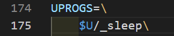

# Lab: Xv6 and Unix utilities

This experiment will familiarize you with the xv6 operating system and its system calls.

## Boot xv6

First, refer to [Tools Used in 6.1810](https://pdos.csail.mit.edu/6.828/2022/tools.html) to configure the following system environment. Here, I am using Macbook M1 Pro.

~~~bash
$ xcode-select --install
~~~

Next, install `Homebrew`, a package manager for macOS:

~~~bash
$ /bin/bash -c "$(curl -fsSL https://raw.githubusercontent.com/Homebrew/install/HEAD/install.sh)"
~~~

Then, install the RISC-V compiler toolchain:

~~~bash
$ brew tap riscv/riscv
$ brew install riscv-tools
~~~

> The brew formula may not link into /usr/local. You will need to update your shell's rc file (e.g. `~/.bashrc`) to add the appropriate directory to `$PATH`.

~~~bash
PATH=$PATH:/usr/local/opt/riscv-gnu-toolchain/bin
~~~

Finally, install QEMU:

~~~bash
$ brew install qemu
~~~

Clone the xv6 code and test it.

~~~bash
git clone git://g.csail.mit.edu/xv6-labs-2023
cd xv6-labs-2023
make qemu
~~~

You can run the following `ls` command to view its files.

In xv6, there is no `ps` command, but you can type `Ctrl-P`, and the kernel will print information about each process.

To exit qemu, type `Ctrl-a x` (hold down `Ctrl` and `a` simultaneously, then release and press `x`).

## sleep

Implement a `user-level` sleep program for xv6, along the lines of the UNIX sleep command. Your sleep should `pause` for a user-specified `number of ticks`. A tick is a notion of time defined by the xv6 kernel, namely the time between two interrupts from the timer chip. Your solution should be in the file `user/sleep.c`.

Some hints:

1. Your program is named `sleep`, with the file named `sleep.c`, saved in `user/sleep.c`.
2. Before starting, you should read Chapter 1 of the [xv6 book](https://pdos.csail.mit.edu/6.828/2022/xv6/book-riscv-rev3.pdf).
3. Utilize the system call `sleep`.
4. The `main` function should end with `exit(0)`.
5. Add your `sleep` function to `UPROGS` in the `Makefile`; only then will it be compiled when you run `make qemu`.

~~~c
#include "kernel/types.h"
#include "kernel/stat.h"
#include "user/user.h"

int 
main(int argc, char* argv[])
{
    if (argc != 2) 
    {
        fprintf(2, "Usage: sleep + [time]\n");
    }
    int time = atoi(*++argv);
    if (sleep(time) != 0) 
    {
        fprintf(2, "Error in sleep sys_call!\n");
    }
    exit(0);
}
~~~

Add `$U/_sleep\` to the `Makefile` as shown in the following diagram:

Then run `make qemu`, and execute the `sleep` function afterwards.

~~~bash
make qemu
sleep 10
(nothing happens for a little while)
~~~

You can run the following command to test the program you wrote:

~~~bash
./grade-lab-util sleep
== Test sleep, no arguments == sleep, no arguments: OK (3.1s)
== Test sleep, returns == sleep, returns: OK (0.6s)
== Test sleep, makes syscall == sleep, makes syscall: OK (0.6s)
~~~

## pingpong

~~~c
#include "kernel/types.h"
#include "kernel/stat.h"
#include "user/user.h"

int main()
{
    int p2c[2], c2p[2];
    int child_id;
    char* ping = "ping";
    char* pong = "pong";
    char buf[512] = {0};

    // Create pipes
    if (pipe(p2c) == -1 || pipe(c2p) == -1) 
    {
        fprintf(2, "Error: pipe creation error.\n");
        exit(1);
    }

    child_id = fork();
    if (child_id < 0) 
    {
        fprintf(2, "Error: fork failed.\n");
        exit(1);
    }

    if(child_id != 0)
    {
        // parent process
        close(p2c[0]); // close read only write
        close(c2p[1]); // close write only read

        // write ping to the child process (p2c)
        write(p2c[1], ping, strlen(ping));

        // after write then read from the child process (c2p)
        read(c2p[0], buf, sizeof(buf));
        printf("%d: received %s\n", getpid(), buf);
        exit(0);
    }
    else
    {
        // child process
        close(p2c[1]); // close write only read
        close(c2p[0]); // close read only write

        // read from the parent process
        read(p2c[0], buf, sizeof(buf));
        printf("%d: received %s\n", getpid(), buf);

        // write to the parent process
        write(c2p[1], pong, strlen(pong));
        exit(0);
    }
}
~~~

Reference: https://www.geeksforgeeks.org/pipe-system-call/

## primes

This one is a bit tricky; understanding recursion might help a bit. Essentially, it's a prime number sieve implemented using recursion. You'll need to read an article: http://swtch.com/~rsc/thread/

~~~c
#include "kernel/types.h"
#include "user/user.h"

// Dùng sàng Eratosthenes
void
parent(int outfd, int maxn)
{   
    // Đầu ra là outfd (file description)
    for (int i = 2; i <= maxn; ++i)
    {
        write(outfd, &i, 4);
        // 4 là 4 byte (32 bits) là kích thước của một biến kiểu int
    }
}

void
child(int infd)
{
    int btr;
    int n, prime;
    int p[2];

    // process first number
    btr = read(infd, &n, 4); // lưu kết quả trả về từ hàm read
    if (btr == 0)
    {
        return;
    }
    printf("prime %d\n", n);
    prime = n;

    // process the rest number
    pipe(p);
    if (fork() == 0) // tạo một quy trình con
    {
        close(p[1]);
        // Đóng đầu ghi của ống trong quá trình con. Quá trình con chỉ đọc dữ liệu từ ống, không ghi vào ống này.
        child(p[0]);
        // Gọi lại hàm child đệ quy với đầu đọc của ống làm đầu vào. Quá trình con tiếp tục xử lý các số từ đầu vào (p[0]).
        close(p[0]);
        // Đóng đầu đọc của ống trong quá trình con
        exit(0);
    }

    close(p[0]);
    while (read(infd, &n, 4)) 
    {
        // Nếu n là số nguyên tố
        if (n % prime == 0)
        {
            continue;
        }
        // ghi của ống p[1] để chuyển đến các quy trình con khác để tiếp tục xử lý
        write(p[1], &n, 4);
    }
    close(p[1]); // Sau khi tất cả các số đã được xử lý, đầu ghi của ống p[1]
    wait(0); // đợi cho đến khi tất cả các quy trình con kết thúc
}

int
main(int argc, char *argv[])
{
    int p[2]; // parent => child
    pipe(p);
    // parent
    if(fork()) 
    {
        close(p[0]);
        parent(p[1], 35);
        close(p[1]);
        wait(0);
    }
    // child
    else 
    {
        close(p[1]);
        child(p[0]);
        close(p[0]);
        exit(0);
    }
    exit(0);
}
~~~

## find

Some hints:

1. Examine the implementation of `user/ls.c` to see how it reads directories (which are essentially files).
2. Use recursion to read subdirectories.
3. Do not recurse into `.` and `..` files (This is crucial to prevent infinite loops).
4. Changes to the file system persist in QEMU, so use `make clean && make qemu` to clean the file system.
5. String comparison should not use ==; use `strcmp` instead. (This is C, so == compares addresses for strings).

It is highly recommended to understand `user/ls.c`; reading files is essentially no different. The `printf` statements in the program are just for my debugging convenience. In lab 2, you will learn how to use GDB for debugging.

~~~c
#include "kernel/types.h"
#include "kernel/stat.h"
#include "kernel/fs.h"
#include "user/user.h"

/*
 * Function to remove trailing white spaces from a string
 * Parameters:
 *   - path: The string to be trimmed
 * Returns:
 *   - A pointer to the modified string
 */
char* 
rtrim(char* path)
{
    static char newStr[DIRSIZ+1];  // Static buffer to hold the modified string
    int whiteSpaceSize = 0;         // Variable to store the size of trailing white spaces
    int bufSize = 0;                // Variable to store the size of the resulting string
    
    // Loop through the string from the end to find the trailing white spaces
    for(char* p = path + strlen(path) - 1; p >= path && *p == ' '; --p) 
    {
        ++whiteSpaceSize;  // Counting the trailing white spaces
    }
    
    // Calculate the size of the resulting string after trimming white spaces
    bufSize = DIRSIZ - whiteSpaceSize;
    
    // Copy non-white space characters from the original string to the new string buffer
    memmove(newStr, path, bufSize);
    
    // Null-terminate the new string
    newStr[bufSize] = '\0';
    
    // Return the modified string
    return newStr;
}

/*
 * Recursive function to find a file in a directory and its subdirectories
 * Parameters:
 *   - path: The directory path to search
 *   - name: The name of the file to find
 */
void 
find(char* path, char* name)
{
    char buf[512], *p;              // Buffer to hold file paths, pointer for manipulation
    int fd;                         // File descriptor for directory
    struct dirent de;               // Directory entry structure
    struct stat st;                 // File status structure
    
    // Open the directory specified by the path
    if ((fd = open(path, 0)) < 0) 
    {
        fprintf(2, "find: cannot open %s\n", path);
        return;
    }

    // Get file status of the directory
    if (fstat(fd, &st) == -1) 
    {
        fprintf(2, "find: cannot fstat %s\n", path);
        close(fd);
        return;
    }

    // Switch statement to handle different types of files/directories
    switch (st.type) 
    {

        case T_DEVICE:
        case T_FILE:
            fprintf(2, "find: %s not a path value.\n", path);
            close(fd);
            // printf("==='%s' is a File\n", path);
            break;
        case T_DIR:
            // Check if the path length exceeds the buffer size
            if(strlen(path) + 1 + DIRSIZ + 1 > sizeof buf)
            {
                printf("ls: path too long\n");
                break;
            }
            
            // Create the full path by copying the original path
            strcpy(buf, path);
            p = buf + strlen(buf);
            *p++ = '/';
            
            // Read directory information for files and subdirectories
            while (read(fd, &de, sizeof(de)) == sizeof de) 
            {
                if (de.inum == 0)
                    continue;
                
                // Skip the current directory (.) and parent directory (..)
                if (strcmp(".", rtrim(de.name)) == 0 || strcmp("..", rtrim(de.name)) == 0)
                    continue;
                
                // Append the file/subdirectory name to the path
                memmove(p, de.name, DIRSIZ);
                
                // Null-terminate the path
                p[DIRSIZ] = '\0';
                
                // Get the file status of the current file/subdirectory
                if (stat(buf, &st) == -1) 
                {
                    fprintf(2, "find: cannot stat '%s'\n", buf);
                    continue;
                }
                
                // Print the full path if the file name matches the search name
                if (st.type == T_DEVICE || st.type == T_FILE) 
                {
                    if (strcmp(name, rtrim(de.name)) == 0) 
                    {
                        printf("%s\n", buf);
                        /*for (int i = 0; buf[i] != '\0'; ++i) 
                        {
                            printf("'%d'\n", buf[i]);
                        }*/

                    }
                }
                // Recursively search if the entry is a directory
                else if (st.type == T_DIR) 
                {
                    find(buf, name);
                }
            }
    }
}

int 
main(int argc, char* argv[])
{
    // Check if the number of command-line arguments is correct
    if (argc != 3) 
    {
        fprintf(2, "Usage: find path file.\n");
        exit(0);
    }
    
    char* path = argv[1];  // Extract the path from command-line arguments
    char* name = argv[2];  // Extract the file name to search from command-line arguments
    
    // Call the find function to search for the file
    find(path, name);
    
    exit(0);
}
~~~

## xargs

The `xargs` program converts values passed from a pipe into command-line arguments for other programs.

So how does `xargs` read data from a pipe? Essentially, it reads data from file descriptor 0, which is standard input, as explained in section 1.2 of the [xv6 book](https://pdos.csail.mit.edu/6.828/2022/xv6/book-riscv-rev3.pdf).

The `xargs` program uses the parameters read from the pipe as command-line arguments for other programs.

For example, `echo a | xargs echo` b will output `b a`. `xargs` takes the output `a` from the previous program and uses it as a command-line argument for the subsequent `echo` program. So the above command is equivalent to `echo b a`.

Some hints:

1. Use `fork` and `exec` for each line of output, and use `wait` to wait for the child process to complete.
2. Read each line of input by reading one character at a time until a newline (`'\n'`) appears.
3. `kernel/param.h` defines `MAXARG`, which will be useful when defining an array for parameters.
4. Run `make clean` to clean the file system. Then run `make qemu` again.

~~~bash
make qemu
...
xv6 kernel is booting

hart 1 starting
hart 2 starting
init: starting sh
$ sh < xargstest.sh
$ $ $ $ $ $ hello
hello
hello
$ $
~~~

> Explain: This script is actually `find . b | xargs grep hello`, searching for all lines containing `hello` in the file b.

~~~c
#include "kernel/types.h"
#include "kernel/stat.h"
#include "user/user.h"
#include "kernel/param.h"

int main(int argc, char *argv[])
{
    char *args[MAXARG];
    char line[512];
    int i;

    if(argc < 2){
        fprintf(2, "Usage: xargs command ...\n");
        exit(1);
    }

    // Check for -n option and shift arguments if found
    if(argv[1][0] == '-' && argv[1][1] == 'n' && argv[1][2] == '\0') {
        for(i = 0; i < argc-3; i++){
            args[i] = argv[i+3];
        }
    } else {
        for(i = 0; i < argc-1; i++){
            args[i] = argv[i+1];
        }
    }

    args[i] = line;
    args[i+1] = 0;

    while(1){
        gets(line, sizeof(line));
        if(line[0] == '\0') break;  // break the loop if gets returns an empty string

        int len = strlen(line);
        if (len > 0 && line[len - 1] == '\n') {
            line[len - 1] = 0;  // replace newline with null
        }

        if(fork() == 0){
            exec(args[0], args);
            fprintf(2, "\n", args[0]);
            exit(1);
        }
        wait(0);
    }

    exit(0);
}
~~~